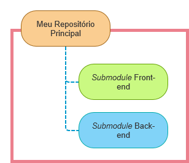
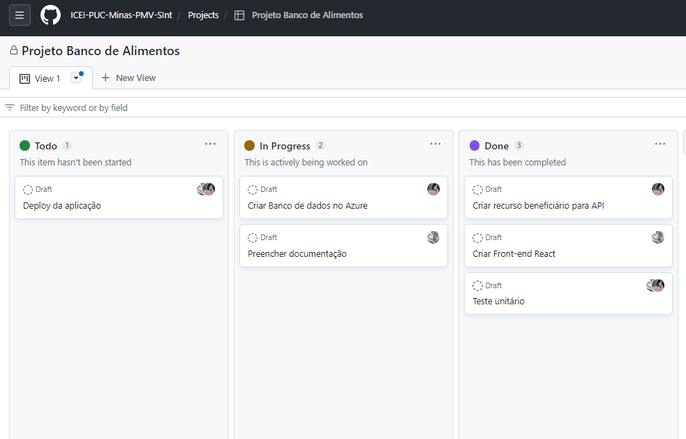

# Metodologia

Pré-requisitos: <a href="2-Especificação do Projeto.md"> Documentação de Especificação</a>

A metodologia adotada para o desenvolvimento do projeto iniciou-se com uma pesquisa realizada por meio de entrevistas com a parte interessada. Depois de identificar e analisar os problemas, seguimos com a estruturação das soluções para atender às necessidades apresentadas.

Para otimizar a organização da equipe e o ambiente de trabalho, optamos por utilizar a metodologia SCRUM. Essa metodologia permite que o trabalho seja realizado de forma simples e dinâmica por meio de pequenos ciclos de atividades (Sprints), que visam resolver problemas complexos e adaptativos.

Para criar uma aplicação web adequada, utilizamos a ferramenta de controle de versão Git e o GitHub como hospedagem do repositório. Para criar e editar as interfaces e wireframes, usamos o Adobe Xd, e para a comunicação em grupo, escolhemos o Whatsapp e o Teams como ferramentas.

## Relação de Ambientes de Trabalho

<table>
 <thead>
  <tr>
   <th>Ambiente</th>
   <th>Plataforma</th>
   <th>Link de Acesso</th>
 </thead>
 <tbody>
  <tr>
   <td>Repositório de Código Fonte</td>
   <td>GitHub</td>
   <td>https://github.com/ICEI-PUC-Minas-PMV-SInt/PMV-SINT-2023-1-E4-PROJ-DIST-T1-Time3-Proj-BancoAlimento</td>
  </tr>
  <tr>
   <td>Documentos do projeto</td>
   <td>GitHub</td>
   <td>https://github.com/ICEI-PUC-Minas-PMV-SInt/PMV-SINT-2023-1-E4-PROJ-DIST-T1-Time3-Proj-BancoAlimento</td>
  </tr>
  <tr>
   <td>Gerenciamento do projeto</td>
   <td>GitHub Projects</td>
   <td>https://github.com/ICEI-PUC-Minas-PMV-SInt/PMV-SINT-2023-1-E4-PROJ-DIST-T1-Time3-Proj-BancoAlimento/projects?query=is%3Aopen</td>
  </tr>
   <tr>
   <td>Projeto de Interface e Wireframes</td>
   <td>Adobe Xd</td>
   <td>https://xd.adobe.com/view/5a4a3523-1b1f-47ca-b05e-6652c55dc192-0f19/</td>
  </tr>
 </tbody>
 </table>

## Controle de Versão

A ferramenta de controle de versão adotada no projeto foi o
[Git](https://git-scm.com/), sendo que o [Github](https://github.com)
foi utilizado para hospedagem do repositório.

O projeto segue a seguinte convenção para o nome de branches:

- `main`: versão estável já testada do software
- `unstable`: versão já testada do software, porém instável
- `testing`: versão em testes do software
- `dev`: versão de desenvolvimento do software

Quanto à gerência de issues, o projeto adota a seguinte convenção para
etiquetas:

- `documentation`: melhorias ou acréscimos à documentação
- `bug`: uma funcionalidade encontra-se com problemas
- `enhancement`: uma funcionalidade precisa ser melhorada
- `feature`: uma nova funcionalidade precisa ser introduzida

Todo o desenvolvimento inicial de recursos deve ocorrer na branch principal (main) do projeto. As atualizações serão enviadas através de commits para o repositório central, que, após a finalização e envio de uma solicitação pull, será mesclado no projeto. As tags serão utilizadas para destacar estágios do desenvolvimento de algum recurso. Para separar o Front-end do Back-end no projeto, utilizaremos os submodules do Git, pois permitem manter os dois repositórios como subdiretórios do repositório principal. Esses submódulos serão uma referência para outros repositórios, permitindo que um incorpore e rastreie o histórico de versões de código externo.

Fluxo de trabalho por submodules

https://www.atlassian.com/br/git/tutorials/git-submodule

> **Links Úteis**:
> - [Microfundamento: Gerência de Configuração](https://pucminas.instructure.com/courses/87878/)
> - [Tutorial GitHub](https://guides.github.com/activities/hello-world/)
> - [Git e Github](https://www.youtube.com/playlist?list=PLHz_AreHm4dm7ZULPAmadvNhH6vk9oNZA)
>  - [Comparando fluxos de trabalho](https://www.atlassian.com/br/git/tutorials/comparing-workflows)
> - [Understanding the GitHub flow](https://guides.github.com/introduction/flow/)
> - [The gitflow workflow - in less than 5 mins](https://www.youtube.com/watch?v=1SXpE08hvGs)

## Gerenciamento de Projeto

### Divisão de Papéis

A equipe utiliza metodologias ágeis, tendo escolhido o Scrum como base para definição do processo de desenvolvimento. 

A equipe está organizada da seguinte maneira:
- Scrum Master: Elaine Souza Melo;
- Product Owner: Amanda Paloma Lourenço;
- Equipe de Desenvolvimento: Amanda Paloma Lourenço e Elaine Souza Melo;

> **Links Úteis**:
> - [11 Passos Essenciais para Implantar Scrum no seu Projeto](https://mindmaster.com.br/scrum-11-passos/)
> - [Scrum em 9 minutos](https://www.youtube.com/watch?v=XfvQWnRgxG0)
> - [Os papéis do Scrum e a verdade sobre cargos nessa técnica](https://www.atlassian.com/br/agile/scrum/roles)

### Processo

No projeto do Banco de Alimentos (BA), serão planejadas Sprints para levantamento de fluxos de:
- cadastros dos beneficiários;
- cadastro dos funcionários;
- cadastro da retirada de cestas;
- autenticação de funcionário;
- autenticação de beneficiário; 

Para esse projeto ocorrerão reuniões semanais entre a equipe de desenvolvedores do projeto.

Os backlogs do produto, bem como a entrega dos processos em cada Sprint, serão gerenciados e organizados por meio dos quadros de projeto fornecidos no GitHub com a utilização do modelo de Kanban automatizado. Este facilita o manejo dos backlogs do produto, organizando-os em cada sprint, além de permitir a atribuição das tarefas para cada membro da equipe.

 
> **Links Úteis**:
> - [Planejamento e Gestáo Ágil de Projetos](https://pucminas.instructure.com/courses/87878/pages/unidade-2-tema-2-utilizacao-de-ferramentas-para-controle-de-versoes-de-software)
> - [Sobre quadros de projeto](https://docs.github.com/pt/issues/organizing-your-work-with-project-boards/managing-project-boards/about-project-boards)
> - [Project management, made simple](https://github.com/features/project-management/)
> - [Sobre quadros de projeto](https://docs.github.com/pt/github/managing-your-work-on-github/about-project-boards)
> - [Como criar Backlogs no Github](https://www.youtube.com/watch?v=RXEy6CFu9Hk)
> - [Tutorial Slack](https://slack.com/intl/en-br/)

### Ferramentas

As ferramentas empregadas no projeto são:

- Adobe Xd: criação de protótipo;
- Editor de documento Google: escrita colaborativa entre membros;
- Google Drive: compartilhamento de documentação;
- Lucid: desenho de fluxo;
- Teams: reuniões por vídeo conferência;
- Github: escrita e estruturação do projeto;
- Whatsapp: interação e troca de informações entre a equipe.

O Github foi escolhido por sua simplicidade de acesso, visto que não é necessário instalar um software, o que nos possibilita acessar via web e mobile. Além disso, dada a sua integração com o sistema de controle de versão GIT, ele facilita o gerenciamento dos códigos.

As ferramentas de comunicação foram definidas pela praticidade. O Microsoft Teams foi escolhido para reuniões de alinhamento semanais e o Whatsapp foi escolhido com o foco nas reuniões diárias para rápida resolução de algum tópico e demais tarefas que surgirão diariamente.

Para ferramentas de desenho de tela e prototipagem, utilizamos o Adobe Xd, que nos dá a possibilidade de trabalho em equipe no projeto de maneira simultânea e permite a gestão dos projetos.  Além disso, por ser intuitivo, é de rápida aprendizagem.

Por fim, para criar diagramas, utilizaremos o Lucid para melhor captar as necessidades da nossa solução.
 
> **Possíveis Ferramentas que auxiliarão no gerenciamento**: 
> - [Slack](https://slack.com/)
> - [Github](https://github.com/)
