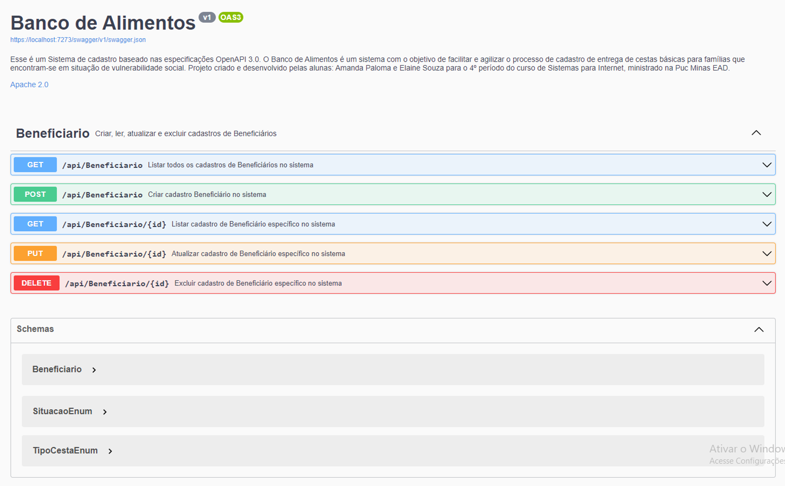

# Programação de Funcionalidades

Para exemplificar uma funcionalidade implementada no sistema, utilizaremos a referência do Requisito RF007.

O sistema utiliza o protocolo HTTP Restful para gerenciamento do lado back-end, onde as requisições e respostas estão relacionadas aos métodos GET, POST, PUT e DELETE.

Para implementação do requisito funcional:

|ID    | Descrição do Requisito  | Prioridade |
|------|-----------------------------------------|----|
|RF-007| Permitir que o usuário consulte, altere e exclua o cadastro dos beneficiários| ALTA |

**Código fonte gerado:**

        [HttpGet]
        [SwaggerOperation(
        Summary = "Listar todos os cadastros de Beneficiários no sistema",
        OperationId = "ListarBeneficiario")]
        public async Task<ActionResult> GetAll()
        {
            var model = await _context.Beneficiarios.ToListAsync();
            return Ok(model);
        }

        [HttpPost]
        [SwaggerOperation(
        Summary = "Criar cadastro Beneficiário no sistema",
        Description = "Requer privelégios de Usuário",
        OperationId = "CriarBeneficiario")]
        [SwaggerResponse(201, "Cadastro criado com sucesso!", typeof(Beneficiario))]
        [SwaggerResponse(400, "Os dados do Benficiciário não são válidos!")]
        public async Task<ActionResult> Create([FromBody]Beneficiario model)
        {
            _context.Beneficiarios.Add(model);
            await _context.SaveChangesAsync();

            return CreatedAtAction("GetById", new { id = model.Id }, model );
        }

        [HttpGet("{id}")]
        [SwaggerOperation(
        Summary = "Listar cadastro de Beneficiário específico no sistema",
        OperationId = "ListarIdBeneficiario")]
        public async Task<ActionResult> GetById(int id)
        {
            var model = await _context.Beneficiarios.AsNoTracking()
                .FirstOrDefaultAsync(c => c.Id == id);

            if (model == null) NotFound();
            return Ok(model);
        }

        [HttpPut("{id}")]
        [SwaggerOperation(
        Summary = "Atualizar cadastro de Beneficiário específico no sistema",
        OperationId = "AtualizarIdBeneficiario")]

        public async Task<ActionResult> Update(int id, Beneficiario model)
        {
            if (id != model.Id) return BadRequest();

            //  var modeloDb = await _context.Beneficiarios.AsNoTracking()
            //   .FirstOrDefaultAsync(c => c.Id == id);
            var modeloDb = await _context.Beneficiarios.FindAsync(id);
           
            if (modeloDb==null) return NotFound();

            _context.Entry(modeloDb).State = EntityState.Detached;

            

            _context.Beneficiarios.Update(model);
            await _context.SaveChangesAsync();

            return NoContent();
        }

        [HttpDelete("{id}")]
        [SwaggerOperation(
        Summary = "Excluir cadastro de Beneficiário específico no sistema",
        Description = "Requer privelégios de Administrador",
        OperationId = "ExcluirIdBeneficiario")]
        public async Task<ActionResult> Delete (int id) 
        {
            var model = await _context.Beneficiarios.FindAsync(id);

            if (model == null) NotFound();

            if (model != null)
            {
                _context.Beneficiarios.Remove(model);
                await _context.SaveChangesAsync();
            }
            

            return NoContent();
      
        }

**Artefato gerado:**

## Implantação do sistema

https://youtu.be/CfqbH65AKno

https://github.com/ICEI-PUC-Minas-PMV-SInt/PMV-SINT-2023-1-E4-PROJ-DIST-T1-Time3-Proj-BancoAlimento/assets/89153098/fd6b5e6c-3f7d-4a5f-a33b-cc04cf2e4cc4

> **Links Úteis**:
>
> - [Trabalhando com HTML5 Local Storage e JSON](https://www.devmedia.com.br/trabalhando-com-html5-local-storage-e-json/29045)
> - [JSON Tutorial](https://www.w3resource.com/JSON)
> - [JSON Data Set Sample](https://opensource.adobe.com/Spry/samples/data_region/JSONDataSetSample.html)
> - [JSON - Introduction (W3Schools)](https://www.w3schools.com/js/js_json_intro.asp)
> - [JSON Tutorial (TutorialsPoint)](https://www.tutorialspoint.com/json/index.htm)
